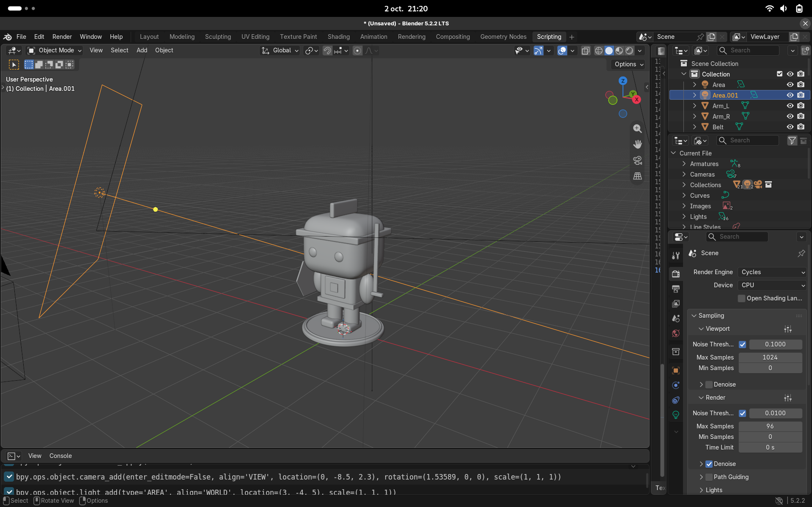
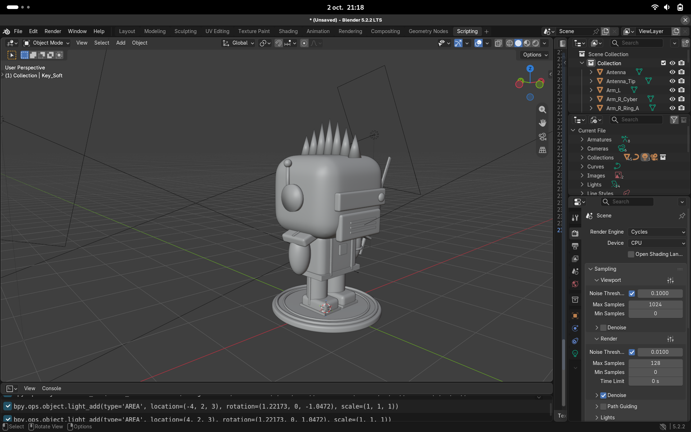

# Blender Pop Tools 🤖✨


**`blender-pop-tools`** est un hub open source de **templates Python pour Blender**. Chaque template génère en un clic une figurine de collection de type *Pop Vinyl* (proportions chibi, matériaux vinyles, éclairage de studio) prête à être rendue avec **Cycles**.

Pas de modélisation manuelle, pas d'assets externes : tout est procédural, lisible et modifiable.

---

## 📂 Structure du projet

```text
blender-pop-tools/
│
├── characters/              # Templates de figurines complètes
│   ├── cyber_knight.py     # Chevalier cyberpunk (néon cyan/magenta)
│   └── chevalier.py     
│
├── props/                   # (à venir) Accessoires : armes, boucliers, socles…
├── materials/               # (à venir) Bibliothèque de matériaux réutilisables
├── scenes/                  # (à venir) Setups studio : caméra, lumières, fonds
├── utils/                   # (à venir) Helpers partagés (add, vinyl, neon…)
│
└── README.md
```


<p align="center">
   &nbsp; &nbsp; 
  
</p>

---

## 🎨 Templates disponibles

| Template | Fichier | Style | Points forts |
|---|---|---|---|
| **chevalier** | `characters/chevalier.py` | Chevalier néon | Casque, épée énergétique, bouclier holographique, studio 2 lumières |
| **cyber_knight** | `characters/cyber_knight.py` | Cyberpunk urbain | Visière LED, mohawk néon, bras cybernétique, katana, câbles, sol mouillé, enseigne néon |

---

## 🚀 Utilisation rapide

1. Ouvrez **Blender** (3.x ou 4.x).
2. Passez dans l'onglet **Scripting**.
3. Cliquez sur **Open** et choisissez un fichier de `characters/` (ou collez son contenu dans l'éditeur).
4. Cliquez sur **Run Script** (ou `Alt + P`).
5. Lancez le rendu avec `F12`.

> ⚠️ Chaque script **vide la scène** au démarrage. Sauvegardez votre travail avant de l'exécuter.

---

## 🧩 Anatomie d'un template

Tous les scripts suivent la même structure, ce qui les rend faciles à lire, modifier et combiner :

1. **Nettoyage de la scène** : suppression des objets existants et purge des données orphelines (maillages, matériaux, courbes inutilisés).
2. **Matériaux procéduraux** :
   - `vinyl()` : plastique brillant via le nœud *Principled BSDF* (couleur, rugosité, métal).
   - `neon()` : effets lumineux via un shader d'émission (couleur, intensité).
3. **Helper `add()`** : crée une primitive (cube, cylindre, sphère, tore, cône…), applique l'échelle, le lissage et, au choix, un modificateur *Bevel* + *Subdivision* pour l'aspect vinyle arrondi.
4. **Modélisation modulaire** : socle, jambes, corps, tête, accessoires, chacun créé via `add()`.
5. **Setup studio et rendu** : caméra, lumières de type *Area Light*, fond, et moteur **Cycles** configuré.

### Le helper `add()`

```python
add("cube", "Head", (0, 0, 1.92),
    scale=(1.5, 1.3, 1.25),   # proportions Pop : grosse tête
    mat=skin,                  # matériau à appliquer
    bevel=0.35,                # arrondi du vinyle (0 = désactivé)
    size=1)                    # paramètre natif de la primitive
```

Les paramètres supplémentaires (`size`, `radius`, `depth`, `vertices`…) sont transmis directement à l'opérateur Blender de la primitive.

---

## 🎛️ Personnalisation

La plupart des templates exposent leur palette au début de la fonction principale :

```python
CYAN    = (0.0, 0.95, 1.0)
MAGENTA = (1.0, 0.0, 0.55)
PURPLE  = (0.45, 0.1, 1.0)
```

Quelques réglages courants :

- **Autre ambiance** : changez les couleurs (ex. `(1.0, 0.5, 0.0)` pour un look orange/cyan).
- **Intensité du néon** : modifiez le dernier paramètre de `neon(nom, couleur, intensité)`.
- **Qualité de rendu** : ajustez `scene.cycles.samples`.
- **Format** : modifiez `scene.render.resolution_x` / `resolution_y`.

---

## 🛠️ Créer son propre template

Copiez ce squelette dans `characters/mon_personnage.py` :

```python
import bpy


def clear_scene():
    bpy.ops.object.select_all(action='SELECT')
    bpy.ops.object.delete()
    for block in (bpy.data.meshes, bpy.data.materials):
        for item in list(block):
            if item.users == 0:
                block.remove(item)


def vinyl(name, color, rough=0.2):
    mat = bpy.data.materials.new(name)
    mat.use_nodes = True
    b = mat.node_tree.nodes["Principled BSDF"]
    b.inputs['Base Color'].default_value = (*color, 1.0)
    b.inputs['Roughness'].default_value = rough
    return mat


def add(prim, name, loc, scale=(1, 1, 1), mat=None, **kw):
    getattr(bpy.ops.mesh, f"primitive_{prim}_add")(location=loc, **kw)
    obj = bpy.context.active_object
    obj.name = name
    obj.scale = scale
    bpy.ops.object.transform_apply(scale=True)
    bpy.ops.object.shade_smooth()
    if mat:
        obj.data.materials.append(mat)
    return obj


def create_my_character():
    clear_scene()
    body_mat = vinyl("Body", (0.8, 0.2, 0.2))
    add("cube", "Body", (0, 0, 1.0), scale=(0.9, 0.6, 0.75), mat=body_mat, size=1)
    # ... tête, accessoires, caméra, lumières ...


create_my_character()
```

### Conventions recommandées

- Un fichier = un personnage, avec une fonction `create_<nom>()` appelée en bas du script.
- Axes Blender : **Z vers le haut**, face du personnage vers **-Y**.
- Nommez chaque objet (`Head`, `Arm_L`, `Sword_Blade`…) pour faciliter les modifications dans le viewport.
- Utilisez le préfixe `Neon_` pour les matériaux émissifs et `Vinyl_` pour les matériaux plastiques.
- Évitez les dépendances externes : uniquement `bpy` et la bibliothèque standard.

---

## 🤝 Contribuer

Les contributions sont les bienvenues !

1. **Forkez** le dépôt.
2. Créez une branche : `git checkout -b feature/mon-personnage`.
3. Ajoutez votre template dans le bon dossier et mettez à jour le tableau des templates ci-dessus.
4. Vérifiez que le script s'exécute sans erreur sur une scène vide (Blender 3.x et 4.x si possible).
5. Ouvrez une **Pull Request** avec un rendu d'exemple.

Les idées de templates (fantasy, robots, animaux, sci-fi, rétro…) peuvent être proposées via les **Issues**.

---

## 🗺️ Roadmap

- [ ] Extraire les helpers communs (`add`, `vinyl`, `neon`, `clear_scene`) dans `utils/`
- [ ] Bibliothèque de matériaux : vinyle mat, métal brossé, verre, hologramme
- [ ] Setups de studio réutilisables : fond infini, boîte de collection, scène néon
- [ ] Génération d'une boîte *Pop* avec fenêtre transparente
- [ ] Export prêt pour l'impression 3D (fusion des pièces + STL)
- [ ] Packaging en add-on Blender avec interface graphique (N-panel)

---

## 📋 Compatibilité

| Élément | Version |
|---|---|
| Blender | 3.x et 4.x |
| Moteur de rendu | Cycles |
| Dépendances | Aucune (`bpy` uniquement) |

---

## 📜 Licence

Ce projet est open source et distribué sous licence **MIT**. Vous êtes libre de l'utiliser, le modifier et le redistribuer, y compris à des fins commerciales.

---

<p align="center">Fait avec ❤️ et beaucoup de néons.</p>